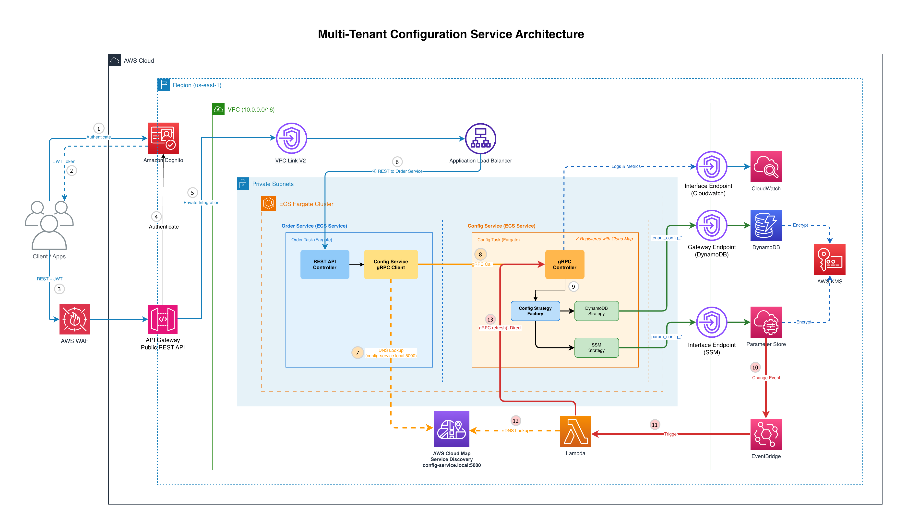

# Multi-Tenant Configuration Service with Event-Driven Refresh

Scalable multi-tenant configuration service built with NestJS, featuring intelligent storage routing, JWT-based tenant isolation, and event-driven auto-refresh capabilities. This project demonstrates AWS best practices for building secure, multi-tenant SaaS applications with zero-downtime configuration updates.

---

## Table of Contents

- [Overview](#overview)
- [Architecture](#architecture)
- [Features](#features)
- [Tech Stack](#tech-stack)
- [Project Structure](#project-structure)
- [Prerequisites](#prerequisites)
- [Quick Start](#quick-start)
- [Documentation](#documentation)
- [Security Highlights](#security-highlights)
- [Demo Credentials](#demo-credentials)
- [Contributing](#contributing)
- [License](#license)

---

## Overview

This project solves three critical challenges in microservices architecture:

1. **Multi-Tenant Configuration Management** - Securely manage configurations for multiple tenants with complete data isolation
2. **Intelligent Storage Routing** - Automatically route configuration requests to optimal storage backends (DynamoDB for tenant-specific configs, SSM Parameter Store for shared parameters)
3. **Zero-Downtime Updates** - Event-driven architecture enables configuration updates without service restarts or connection drops

The solution demonstrates a **tagged storage pattern** using the Strategy design pattern, where configuration keys (prefixed with `tenant_config_` or `param_config_`) determine the storage backend, enabling flexible, scalable configuration management.

### Why This Matters

- **Tenant Isolation**: JWT-based authentication with `custom:tenantId` claims ensures tenants can never access each other's data
- **Performance**: In-memory caching with event-driven refresh provides microsecond response times while maintaining data freshness
- **Operational Simplicity**: EventBridge + Lambda automatically propagates configuration changes without manual intervention
- **Cost Efficiency**: Pay-per-request pricing with aggressive caching minimizes AWS API costs

### Security Notices for Production

While this project implements security best practices, there are important considerations when deploying to production environments:

**Health Check Endpoint (Unauthenticated):**

The `/api/v1/health` endpoint has no authentication to support ALB health checks and monitoring services. It's protected by WAF rate limiting and returns only `{"status": "ok"}` with no sensitive data.

**For production:** Enable JWT authentication by changing `AuthorizationType: NONE` to `AuthorizationType: JWT` in the `HealthRoute` resource in `app-infrastructure.yaml`.

**Internal ALB Uses HTTP (Not HTTPS):**

The internal ALB uses HTTP within the private VPC for reduced latency and simplified certificate management. SSL/TLS termination occurs at API Gateway, and all external traffic is encrypted.

**For production with compliance requirements (PCI-DSS, HIPAA):** Enable HTTPS on the ALB by adding an ACM certificate, changing the listener port from 80 to 443, updating the protocol to HTTPS, and modifying security group rules to allow port 443.

**ECS Security Group Egress (0.0.0.0/0 on port 443):**

ECS tasks have egress rules allowing HTTPS (443) to 0.0.0.0/0 to reach AWS services (DynamoDB, ECR, SSM, KMS, CloudWatch) via VPC endpoints. The private subnets have no NAT Gateway or Internet Gateway, so there is no actual internet path—only private AWS endpoint access is possible.

**For production:** Consider restricting egress to specific VPC CIDR ranges or VPC endpoint security groups for additional defense-in-depth, though the lack of internet gateway already prevents external access.

**ECR GetAuthorizationToken Permission:**

`ecr:GetAuthorizationToken` requires `"Resource": "*"` because AWS does not allow scoping this action to specific repositories. This permission is necessary for ECS Task Execution Role to obtain registry credentials for pulling container images. All other ECR actions (BatchGetImage, GetDownloadUrlForLayer, etc.) are restricted to specific repository ARNs via ECR repository policies to maintain least privilege.

**For production:** ECR repository policies already restrict pull/push access to the AWS account root principal. For cross-account scenarios, update the repository policy to explicitly allow specific IAM roles or accounts.

---

## Architecture



### Request Flow

```
Client (HTTPS with JWT)
    ↓
API Gateway (with Cognito Authorizer + WAF)
    ↓ (VPC Link)
Application Load Balancer (Internal)
    ↓
Order Service (ECS Fargate) - Port 3001
    ↓ (gRPC with JWT forwarding)
Config Service (ECS Fargate) - Port 5000
    ↓ (Strategy Pattern routing)
DynamoDB (tenant configs) / SSM Parameter Store (shared params)
```

### Event-Driven Refresh Flow

```
SSM Parameter Update
    ↓
EventBridge Rule (detects /config-service/* changes)
    ↓
Lambda Function (extracts tenantId)
    ↓ (gRPC call)
Config Service (reloads in-memory cache)
    ↓
Zero-downtime configuration refresh
```

---

## Features

### Core Capabilities

- **Multi-Tenant Data Isolation** - Composite key schema (`TENANT#{tenantId}`, `CONFIG#{type}`)
- **Strategy Pattern Storage** - Automatic routing to DynamoDB or SSM based on key prefix
- **JWT-Based Authentication** - AWS Cognito with custom `tenantId` claim
- **gRPC Communication** - High-performance, type-safe service-to-service calls
- **Event-Driven Refresh** - EventBridge + Lambda for zero-downtime updates
- **In-Memory Caching** - Microsecond response times with automatic cache invalidation
- **Soft Deletion** - `isActive` flag preserves audit trails
- **Configuration Versioning** - Track changes over time

### Security Features

- **Never Accept tenantId from Request** - Always extracted from validated JWT tokens
- **Multi-Guard Architecture** - `CognitoJwtGuard` + `TenantAccessGuard` for defense in depth
- **VPC Isolation** - Services run in private subnets with no internet access
- **KMS Encryption** - All data encrypted at rest
- **Internal ALB** - Not exposed to public internet
- **Service Discovery** - Config Service accessible only via AWS Cloud Map DNS

### Operational Features

- **Structured Logging** - Winston with JSON formatting
- **Health Checks** - Kubernetes-style liveness/readiness probes
- **CloudWatch Integration** - Metrics, logs, and alarms
- **Auto-Scaling** - ECS Fargate with target tracking policies
- **Spot Instances** - Cost optimization with Fargate Spot

---

## Tech Stack

| Category           | Technology                                                   |
| ------------------ | ------------------------------------------------------------ |
| **Framework**      | NestJS 10.x, TypeScript 5.x                                  |
| **Communication**  | gRPC (@grpc/grpc-js), Protocol Buffers                       |
| **Storage**        | Amazon DynamoDB, AWS Systems Manager Parameter Store         |
| **Authentication** | AWS Cognito (JWT with custom claims)                         |
| **Compute**        | AWS ECS Fargate, AWS Lambda                                  |
| **Networking**     | Application Load Balancer, AWS Cloud Map (Service Discovery) |
| **Events**         | Amazon EventBridge                                           |
| **Infrastructure** | AWS CloudFormation, Docker                                   |
| **Logging**        | Winston, CloudWatch Logs                                     |
| **Testing**        | Jest, grpcurl                                                |

---

## Project Structure

```
config-service-monorepo/
├── apps/
│   ├── config-service/        # Main configuration service (gRPC)
│   │   ├── src/
│   │   │   ├── configuration/ # Strategy pattern implementation
│   │   │   ├── ssm/           # SSM Parameter Store integration
│   │   │   └── health/        # Health check endpoints
│   │   └── test/              # Unit & integration tests
│   └── order-service/         # Demo consumer service (REST)
│       └── src/
│           ├── orders/        # Order management
│           └── config/        # gRPC client for config service
├── libs/
│   ├── auth/                  # JWT validation & tenant guards
│   ├── filters/               # Exception filters & pipes
│   ├── logger/                # Structured logging
│   └── proto/                 # Protocol Buffer definitions
└── infrastructure/
    ├── data-layer.yaml        # DynamoDB, Cognito, ECR
    ├── app-infrastructure.yaml # VPC, ECS, ALB, Service Discovery
    ├── event-driven-refresh.yaml # EventBridge, Lambda
    ├── architecture/          # Architecture diagrams
    ├── testing/               # Testing scripts and guide
    ├── lambda/                # Lambda refresh trigger
    └── scripts/               # Deployment scripts
```

---

## Prerequisites

- **Node.js** 18+ installed
- **AWS CLI** configured with credentials
- **Docker** (for building images)
- **grpcurl** for gRPC testing: `brew install grpcurl`
- **jq** for JSON processing: `brew install jq`

---

## Quick Start

### Local Development

```bash
# 1. Clone the repository
git clone <repository-url>
cd config-service-monorepo

# 2. Install dependencies
npm install
npm run install:libs
npm run install:config-service
npm run install:order-service

# 3. Copy environment file
cp .env.example .env
cd apps/order-service && cp .env.example .env
# Edit .env with your AWS credentials and Cognito details

# 4. Seed test data
export COGNITO_USER_POOL_ID=<your-pool-id>
npx ts-node infrastructure/scripts/seed-tenants.ts

# 5. Set passwords for test users
aws cognito-idp admin-set-user-password \
  --user-pool-id $COGNITO_USER_POOL_ID \
  --username admin@acme-corp.com \
  --password 'AcmeAdmin@2024' \
  --permanent

aws cognito-idp admin-set-user-password \
  --user-pool-id $COGNITO_USER_POOL_ID \
  --username user@acme-corp.com \
  --password 'AcmeUser@2024' \
  --permanent

aws cognito-idp admin-set-user-password \
  --user-pool-id $COGNITO_USER_POOL_ID \
  --username admin@globex-inc.com \
  --password 'GlobexAdmin@2024' \
  --permanent

aws cognito-idp admin-set-user-password \
  --user-pool-id $COGNITO_USER_POOL_ID \
  --username user@globex-inc.com \
  --password 'GlobexUser@2024' \
  --permanent

# 6. Start config service (port 3000, gRPC 5000)
npm run start:config-service

# 7. In another terminal, start order service (port 3001)
npm run start:order-service

# 8. Test the services
./infrastructure/testing/test-local.sh
```

### AWS Deployment

For complete deployment instructions, see [infrastructure/README.md](infrastructure/README.md).

**Quick deployment overview:**

```bash
# 1. Deploy data layer (DynamoDB, Cognito, ECR)
aws cloudformation create-stack --stack-name config-service-data \
  --template-body file://infrastructure/data-layer.yaml \
  --capabilities CAPABILITY_NAMED_IAM

# 2. Build and push Docker images
./infrastructure/scripts/deploy.sh config-service
./infrastructure/scripts/deploy.sh order-service

# 3. Deploy application infrastructure (VPC, ECS, ALB)
aws cloudformation deploy --stack-name config-service-app \
  --template-file infrastructure/app-infrastructure.yaml \
  --capabilities CAPABILITY_NAMED_IAM

# 4. Build Lambda and deploy event-driven refresh
./infrastructure/scripts/build-lambda.sh dev
aws cloudformation create-stack --stack-name config-service-event-driven-refresh \
  --template-body file://infrastructure/event-driven-refresh.yaml \
  --capabilities CAPABILITY_NAMED_IAM

# 5. Seed tenant data and create test users
npx ts-node infrastructure/scripts/seed-tenants.ts

# 6. Set passwords for test users
aws cognito-idp admin-set-user-password \
  --user-pool-id $COGNITO_USER_POOL_ID \
  --username admin@acme-corp.com \
  --password 'AcmeAdmin@2024' \
  --permanent

aws cognito-idp admin-set-user-password \
  --user-pool-id $COGNITO_USER_POOL_ID \
  --username user@acme-corp.com \
  --password 'AcmeUser@2024' \
  --permanent

aws cognito-idp admin-set-user-password \
  --user-pool-id $COGNITO_USER_POOL_ID \
  --username admin@globex-inc.com \
  --password 'GlobexAdmin@2024' \
  --permanent

aws cognito-idp admin-set-user-password \
  --user-pool-id $COGNITO_USER_POOL_ID \
  --username user@globex-inc.com \
  --password 'GlobexUser@2024' \
  --permanent
```

---

## Documentation

- **[infrastructure/README.md](infrastructure/README.md)** - Complete deployment guide with step-by-step instructions
- **[infrastructure/testing/README.md](infrastructure/testing/README.md)** - Local and cloud testing guide
- **[infrastructure/architecture/architecture-diagram.drawio](infrastructure/architecture/architecture-diagram.drawio)** - System architecture diagram
- **[docs/blog.md](docs/blog.md)** - Technical deep-dive article explaining architecture decisions
- **[apps/order-service/INTEGRATION_TESTING.md](apps/order-service/INTEGRATION_TESTING.md)** - Order service integration testing

---

## Security Highlights

### Tenant Isolation

The service enforces tenant isolation at multiple layers:

1. **Authentication Layer**: AWS Cognito validates user identity and attaches `custom:tenantId` to JWT claims
2. **Authorization Layer**: `TenantAccessGuard` ensures users can only access their tenant's data
3. **Data Layer**: DynamoDB composite keys (`TENANT#{tenantId}`) provide logical separation
4. **Never Trust Client Input**: `tenantId` is ALWAYS extracted from validated JWT, NEVER from request parameters

### Critical Security Design

```typescript
// ❌ NEVER DO THIS - vulnerable to tenant bypass
async getConfig(tenantId: string) {
  // tenantId from request parameters - INSECURE
}

// ✅ ALWAYS DO THIS - extract from JWT claims
async getConfig(req: AuthenticatedRequest) {
  const tenantId = req.tenantId; // From validated JWT token
}
```

### Additional Security Measures

- **VPC Isolation**: Services run in private subnets with no direct internet access
- **Internal ALB**: Load balancer not exposed to public internet
- **KMS Encryption**: All data encrypted at rest using AWS KMS
- **Service Discovery**: Config Service accessible only via Cloud Map private DNS
- **JWT Validation**: Every request validates JWT signature against Cognito JWKS
- **Least Privilege IAM**: Services use minimal IAM permissions

---

## Demo Credentials

**Note:** The seed script creates users without passwords for security. Set passwords manually using AWS CLI.

### Creating Test Users

After running the seed script, set passwords for test users:

```bash
# Acme Corp users
aws cognito-idp admin-set-user-password \
  --user-pool-id $COGNITO_USER_POOL_ID \
  --username admin@acme-corp.com \
  --password 'AcmeAdmin@2024' \
  --permanent

aws cognito-idp admin-set-user-password \
  --user-pool-id $COGNITO_USER_POOL_ID \
  --username user@acme-corp.com \
  --password 'AcmeUser@2024' \
  --permanent

# Globex Inc users
aws cognito-idp admin-set-user-password \
  --user-pool-id $COGNITO_USER_POOL_ID \
  --username admin@globex-inc.com \
  --password 'GlobexAdmin@2024' \
  --permanent

aws cognito-idp admin-set-user-password \
  --user-pool-id $COGNITO_USER_POOL_ID \
  --username user@globex-inc.com \
  --password 'GlobexUser@2024' \
  --permanent
```

**Password requirements:**
- Minimum 12 characters
- At least one uppercase letter
- At least one lowercase letter  
- At least one number
- At least one special character

### Tenant 1: Acme Corporation

- **Admin Email**: `admin@acme-corp.com` (password: set manually)
- **User Email**: `user@acme-corp.com` (password: set manually)
- **Tenant ID**: `acme-corp`
- **Payment Gateway**: Stripe
- **Min Order Amount**: $500

### Tenant 2: Globex Inc

- **Admin Email**: `admin@globex-inc.com` (password: set manually)
- **User Email**: `user@globex-inc.com` (password: set manually)
- **Tenant ID**: `globex-inc`
- **Payment Gateway**: PayPal
- **Min Order Amount**: $250

### Usage Example

```bash
# Get JWT token for Acme (use your password)
export TOKEN=$(aws cognito-idp initiate-auth \
  --auth-flow USER_PASSWORD_AUTH \
  --client-id $COGNITO_CLIENT_ID \
  --auth-parameters USERNAME=user@acme-corp.com,PASSWORD=YourSecurePassword123! \
  --region us-east-1 \
  --query 'AuthenticationResult.IdToken' \
  --output text)

# Create order (triggers config service call)
curl -X POST http://localhost:3001/api/v1/orders \
  -H "Authorization: Bearer $TOKEN" \
  -H "Content-Type: application/json" \
  -d '{
    "productId": "test-prod-123",
    "quantity": 2,
    "amount": 600.00,
    "currency": "USD"
  }'
```

---

**Key Design Patterns**:

- Strategy Pattern for storage backend selection
- Repository Pattern for data access abstraction
- Guard Pattern for authentication and authorization
- Event-Driven Architecture for configuration updates

---

## Support

For issues, questions, or contributions:

1. Check existing [GitHub Issues](../../issues)
2. Review documentation in the `/docs` folder
3. Create a new issue with detailed information

## Security

See [CONTRIBUTING](CONTRIBUTING.md#security-issue-notifications) for more information.

## License

This library is licensed under the MIT-0 License. See the LICENSE file.
